

## Welcome to Expression Atlas help

### Browse experiments in Expression Atlas

You can browse through the experiments in Expression Atlas in the **Browse experiments** tab,
which shows you a table listing all the experiments currently available in Expression Atlas.
You can filter and/or re-order the table content using the categories and search boxes in the header line.

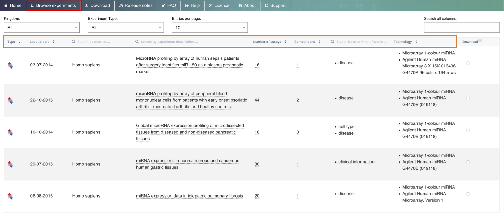

Proteomics experiments can be listd by typing for keyword proteomics in the **search all columns** field.

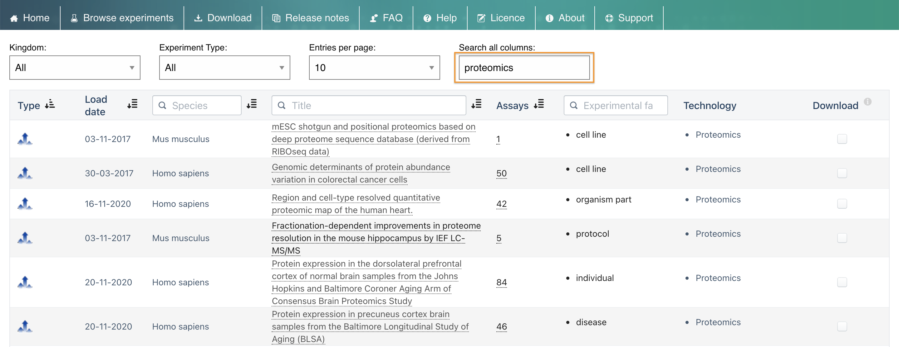

You can also filter the table content using the two boxes above the table - the **Kingdom** and
the **Experiment Type** filter boxes, which allow you to narrow down the results according to your
taxon of interest and/or experiment type (baseline vs differential).

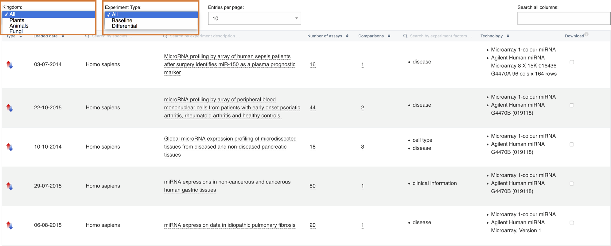

Finally, you can directly download the gene expression data and the experiment metadata as a zip file by
selecting one or more experiments in the table and clicking the **Download entry** link in the table header.

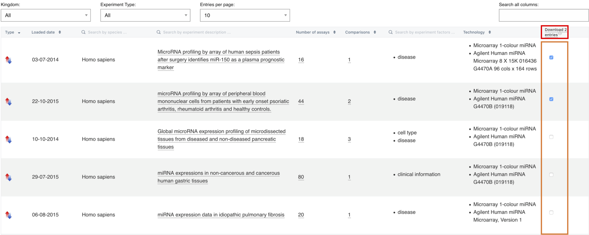

### How to search in Expression Atlas

In Expression Atlas you can either search by gene (e.g. *APOA2*) or by biological condition (e.g.
heart or lung carcinoma). Use the **Gene query search box** to find out in which conditions is
*APOA2* gene expressed (baseline results) and in which conditions is *APOA2* gene
differentially expressed (differential results).

Use the **Condition query search box** to find out what genes are expressed in that particular
condition, e.g. heart (baseline results) or to find out what genes are differentially expressed in the
condition you searched for, e.g. lung carcinoma (differential results).

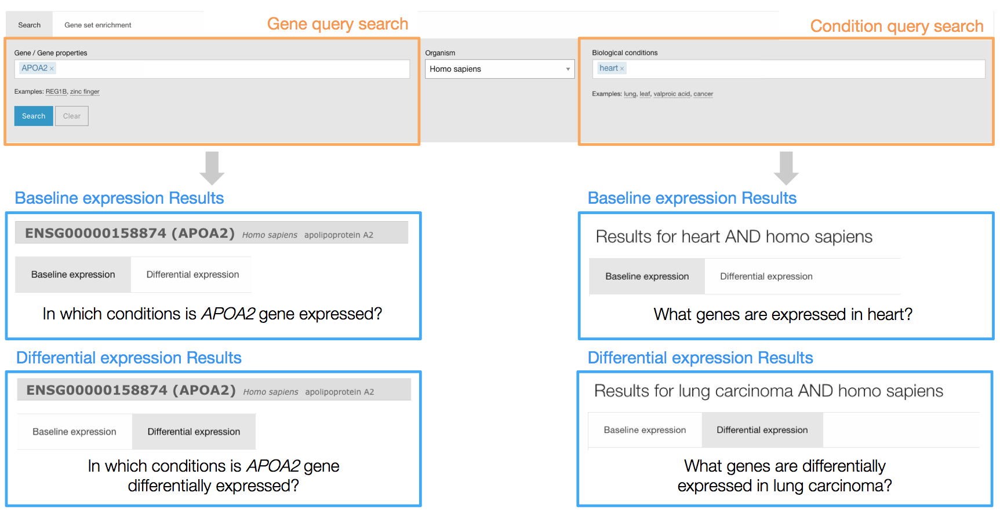

#### Ontology-driven query expansion

Your queries are expanded using the [Experimental Factor Ontology
(EFO)](https://www.ebi.ac.uk/efo/). This means that if you search for e.g. "cancer", you will also see results with terms such
as "carcinoma" and other terms that are children of the cancer entry in EFO.

### Baseline expression results

When you search for a particular gene (e.g. *UMOD*) in one species (e.g. Homo sapiens), the
**Baseline expression results** will show a heatmap with all tissues studied (columns) in different
experiments (rows) in which *UMOD* gene is expressed above the default minimum expression level of
0.5 FPKM or 0.5 TPM.

Expression levels are displayed in a **heatmap** in five different colours:

1. Grey box: expression level is below cutoff (0.5 TPM or FPKM)
2. Light blue box: expression level is low (between 0.5 to 10 TPM or FPKM)
3. Medium blue box: expression level is medium (between 11 to 1000 TPM or FPKM)
4. Dark blue box: expression level is high (more than 1000 TPM or FPKM)
5. White box: there is no data available

#### Filter your results

By default, expression data for different tissues (that is the biological condition pre-selected) are
displayed. However, you can use the filters in the left to explore *UMOD* gene expression in other
biological conditions such as cell lines.

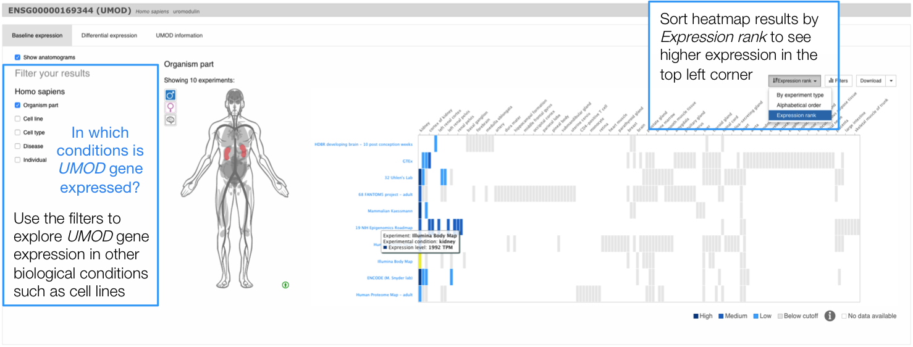

#### Anatomical Systems Filter

Use the **Filters** button above the heatmap to display gene expression in a particular anatomical
system. For example, you can filter the results in the heatmap to show *UMOD* gene expression only
in renal system.

### Baseline experiment page

Each baseline experiment in Expression Atlas has its own Experiment page. Just click in the title of
any experiment in the baseline expression results (e.g. Uhlen's lab) to see the corresponding
**baseline experiment page**. If you want to see gene expression results not only for *UMOD*
gene, you have to remove it from the Genes box and click Apply.

In a baseline experiment page, expression levels are displayed in one heatmap by colour intensity,
according to the gradient bar above the heatmap. The gradient shows intensities corresponding to
expression levels for the 50 genes displayed. Mouse over a cell in the heatmap to see expression values
for each gene in each tissue (or other condition).

#### Specify a minimum expression level

Use the **Expression value** box to specify a different minimum level (the default one is 0.5) so
only genes expressed above this level are displayed.

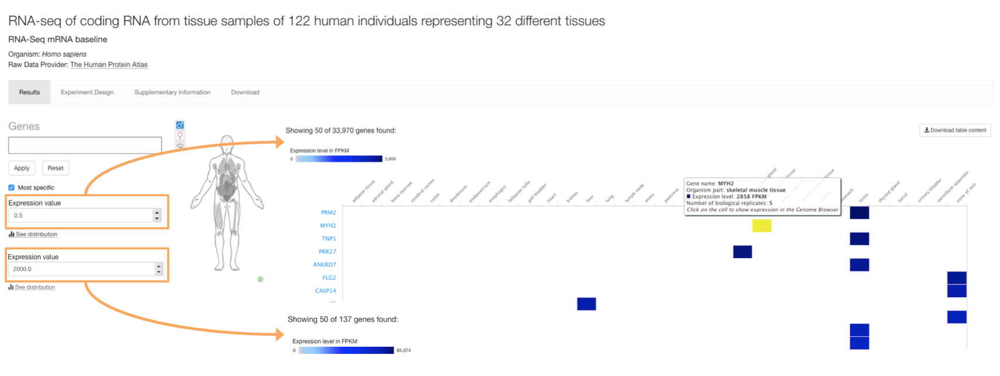

#### Most specific search

By default, the 50 most specifically expressed genes (rows) across all conditions (columns) studied are
displayed. Unclick the **Most specific** option to show genes with highest expression first.

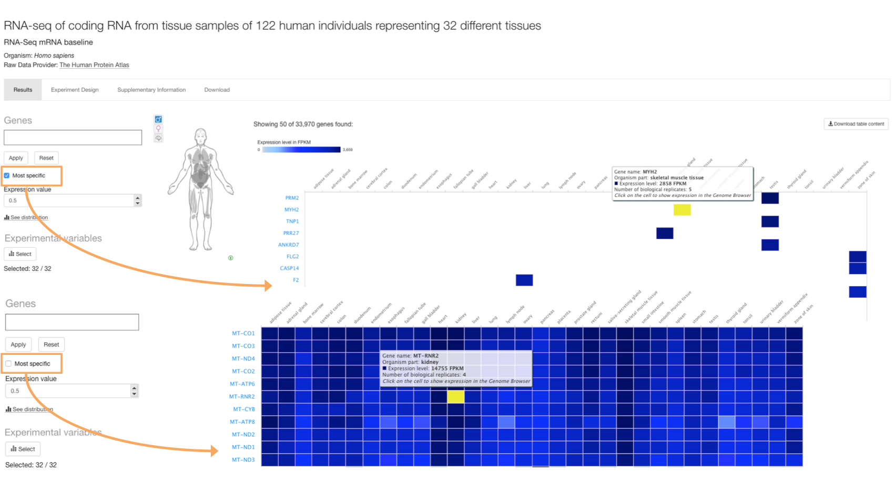

#### Searching with genes

Use the **Genes search box** to search for a particular gene. You can search with Ensembl gene
symbols (e.g. IGLC2), Ensembl ID (e.g. ENSG00000211677), UniProt accessions (e.g. A0A075B6K9) or
InterPro terms (e.g. Immunoglobulin C1-set).

#### Visualise variation among biological replicates

When you search for a particular gene (e.g. *IGLC2*) in the baseline experiment page you have the
option to see the variation of its expression among the biological replicates for each tissue (or other
condition) in the experiment. Click on **Switch to boxplot view** to display a plot per tissue with
the maximum, upper quartile, median, lower quartile and minimum expression values for each set of
biological replicates.

#### Similar expression

Click on **Add similarly expressed genes** button below the heatmap to explore gene co-expression
across tissues (or other condition). A list of genes with similar expression pattern across tissues is
shown. Adjust the number of genes displayed using the slider at the bottom.

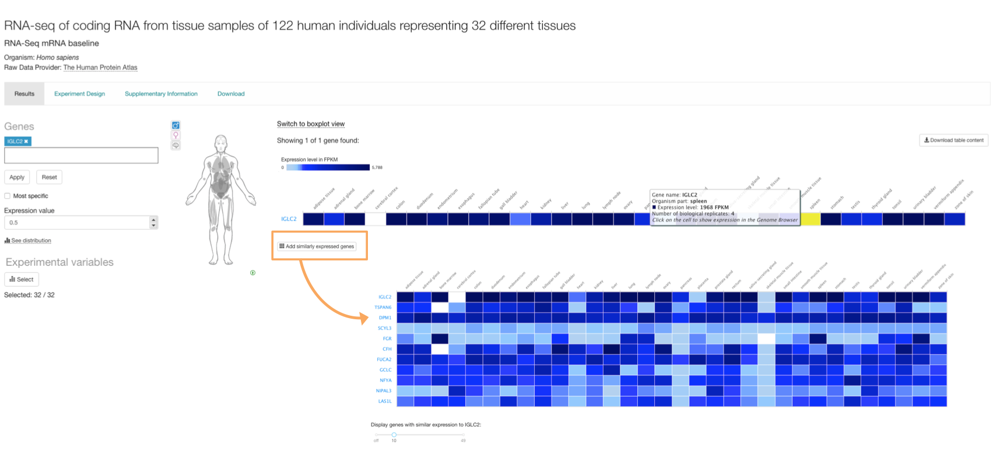

#### Experiments with more than one experimental variable

There are baseline experiments with more than one experimental variable. For example, in experiment
[RNA-seq of long poly adenylated RNA and long non-poly
adenylated RNA from ENCODE cell lines](/gxa/experiments/E-GEOD-26284) three different types of **RNA** were extracted from
six **cellular components** in 23 human **cell lines**. However, only 18 cell lines are shown by
default. If you click on the **Select** button below Experimental variables, you will see that the
18 cell lines displayed by default correspond to the ones satisfying the following criteria:

1. Experimental variable 'cellular component' is whole cell
2. Experimental variable 'RNA' is long polyA RNA

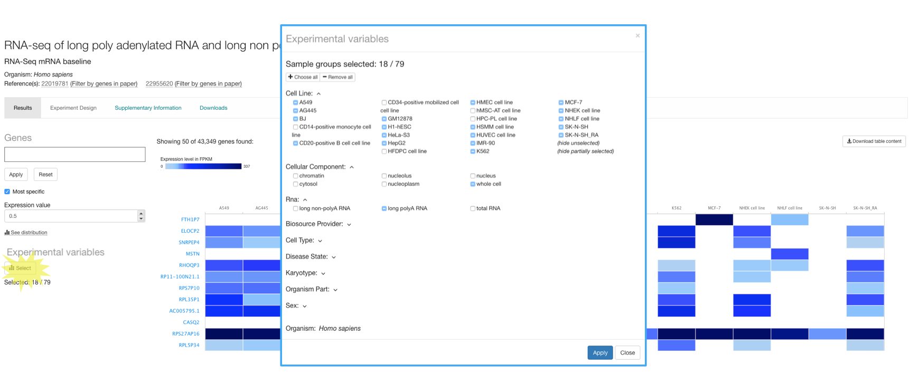

You can display the whole experiment just by clicking on the **Choose all** button in the top of the
**Select Experimental variables** window.

#### Other information in the baseline experiment page

The **Experiment Design** tab shows RNA-seq processing run accessions (from
[ENA](https://www.ebi.ac.uk/ena)), along with their corresponding biological sample
characteristics and experimental variables values.

The **Supplementary Information** tab includes Analysis Methods (list of the analysis methods we
applied to the raw data in FASTQ format to obtain gene expression results) and Resources to see the
experiment in [ArrayExpress](https://www.ebi.ac.uk/arrayexpress/).

The **Downloads** tab contains all the files that you can download such as: i) gene expression
results in tab-delimited format, ii) file containing the R object representing the experiment and iii)
results of hierarchical clustering using the top 100 most variable genes across all tissues (or other
condition) in the experiment.

#### Transcript quantification

As part of our colaboration with [Gramene](http://www.gramene.org/), for baseline plant
experiments, you can also explore expression results at transcript level. From a plant baseline
experiment page, such us this one [studying gene expression of
five different organs of wheat at three different developmental stages](/gxa/experiments/E-MTAB-4484), you can search for a
particular gene, e.g. TRIAE\_CS42\_1AL\_TGACv1\_000002\_AA0000030 to display gene expression across all
conditions studied.

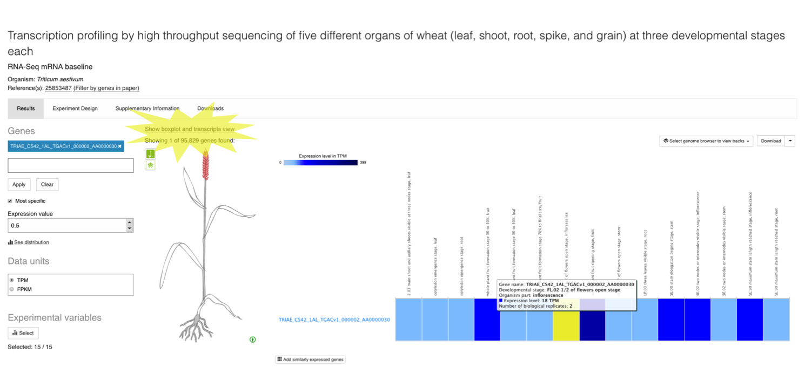

Click on **Show boxplot and transcripts view** to display expression levels of each of the six
transcripts for TRIAE\_CS42\_1AL\_TGACv1\_000002\_AA0000030 gene across the different conditions studied.
Abundance of transcripts from RNA-seq data was quantified using
[kallisto](https://pachterlab.github.io/kallisto/about).

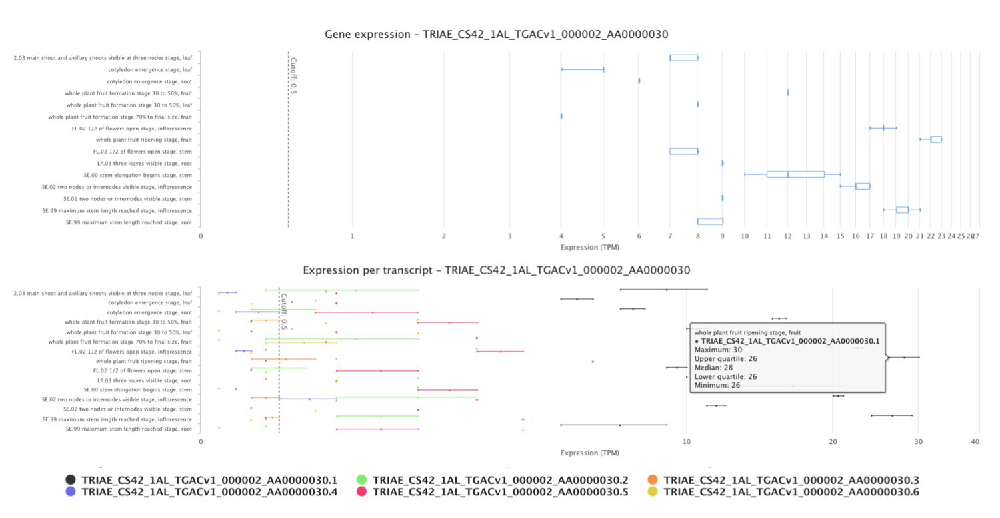

### Differential expression results

When you search for a particular gene (e.g. *UMOD*) in one species (e.g. Homo sapiens), the
**Differential expression results** will show all comparisons in which *UMOD* gene is
differentially expressed (absolute value of log2 fold-change > 1 and adjusted
*p*-value < 0.05). Mouse over each colour boxed to see *UMOD* gene expression values in
each particular comparison. Mouse over each comparison to display more information: experimental
variables are shown in bold along with other characteristics that define each group of samples
compared.

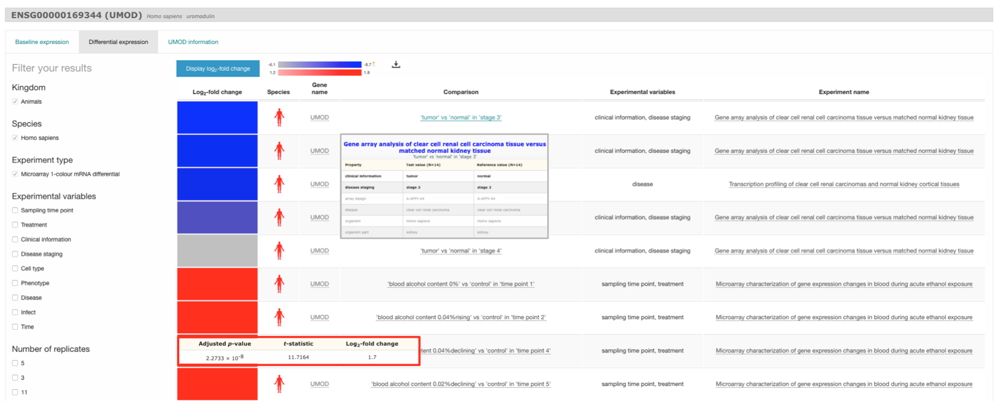

#### Filter your results

You can narrow down the results displayed by using the filters in the left to select, for example, only
comparisons in which *UMOD* gene is up-regulated.

### Differential experiment page

Each differential experiment in Expression Atlas has its own Experiment page. Just click in the title
of any experiment in the differential expression results (e.g. Gene array analysis of clear cell renal
cell carcinoma tissue versus matched normal kidney tissue) to see the corresponding **differential
experiment page**.

In a differential experiment page, differentially expressed genes (rows) in each comparison studied
(column) are displayed in one heatmap by colour intensity, according to the gradient bar above the
heatmap. The gradient shows intensities corresponding to the top 50 differentially expressed genes
displayed. In the case of microarray data, design elements are displayed alongside genes (rows).

The heatmap ranks genes by absolute log2 fold-change. Blue cells indicate the gene is
down-regulated while red ones correspond to up-regulated genes. Mouse over a cell in the heatmap to see
log2 fold-change and adjusted *p*-value (and *t*-statistic for microarray data)
for differentially expressed gene in each comparison.

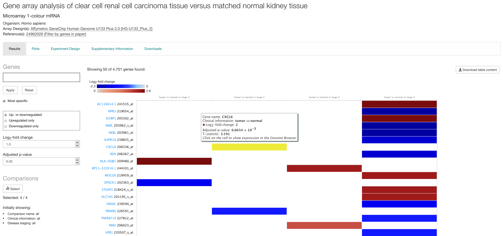

#### Specify different criteria for differential expression

Use the **log2 fold-change** and the **adjusted *p*-value** box to specify
different criteria for differential expression (the default one is log2 fold-change > 1
and adjusted *p*-value < 0.05) so only genes satisfying both criteria are displayed.

#### Searching with genes

Use the **Genes search** box to search for a particular gene. You can search with Ensembl gene
symbols (e.g. NEBL), Ensembl ID (e.g. ENSG00000078114), UniProt accessions (e.g. A0A0U1RRK0) or
InterPro terms (e.g. Nebulin repeat).

On microarray experiments a gene can be represented by more than one design element, also known as
probe or probe set. This is the oligonucleotide probe on the microarray that targets that gene.

#### Most specific search

By default, genes that are differentially expressed in just one comparison are displayed, followed by
genes differentially expressed in two comparisons, then three and so on, reporting genes that are
differentially expressed in all comparisons at the end of the results. Unclick the **Most specific**
option to show genes with largest absolute log2 fold-change in all comparisons first.

#### Select comparisons

Use the **Select** button below Comparisons to display gene expression results for
specific comparisons that are more relevant to you.

#### MA plots and enrichment analysis

The differential experiment page shows an additional tab called **Plots**. Two types of plots can be
visualised:

1. **MA plot** for each comparison. This plot displays the average expression level for each
   gene (normalized microarray intensity level or RNA-Seq log2 counts-per-million) on
   the *x*-axis against log2 fold-change on the *y*-axis. Differentially
   expressed genes at FDR < 0.05 are shown in red in the plot.
2. **Enrichment analysis plots** to see if there is any
   [Gene Ontology](http://www.geneontology.org/),
   [InterPro](https://www.ebi.ac.uk/interpro/) or
   [Reactome](http://www.reactome.org/) term significantly over-represented in the set
   of differentially expressed genes.

Enrichment analysis is performed using the
[Piano](http://www.bioconductor.org/packages/release/bioc/html/piano.html) package from
[Bioconductor](http://www.bioconductor.org/). For each comparison, enrichment between the
set of differentially expressed genes and terms from GO, InterPro and Reactome is performed, using
Fisher's exact test with multiple testing correction (FDR < 0.1). Enrichment analysis plots are
available only when statistically significant enrichment of terms was detected. Click on one plot to
display it.

The plot corresponding to GO terms enrichment analysis shows a maximum of 10 enriched terms
(nodes) from a list sorted by the effect size (i.e. the number of observed divided by the number of
expected genes annotated with a given term within the differentially expressed set of genes). The terms
are linked by edges representing genes shared between them - the more genes shared between the two
terms, the thicker the edge. The size of each node represents the proportion of differentially
expressed genes annotated with each term.

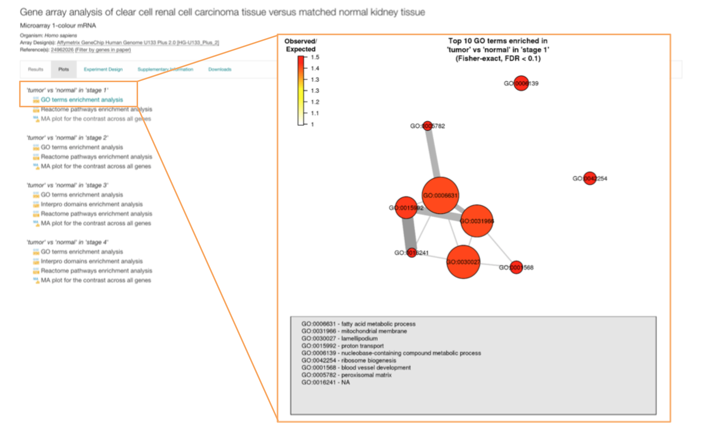

#### Other information in the differential experiment page

The **Experiment Design** tab shows RNA-seq processing run accessions (from
[ENA](https://www.ebi.ac.uk/ena)) or microarray assay accessions, along with their
corresponding biological sample characteristics and experimental variables values.

The **Supplementary Information** tab includes:

1. **Analysis Methods** to see the list of the analysis methods we applied to the raw data to
   obtain differential expression results.
2. **Resources** to see the experiment in
   [ArrayExpress](https://www.ebi.ac.uk/arrayexpress/).
3. **QC report** to see the results of quality assessment for the experiment data files. For
   microarray experiments, this report is generated by the
   [arrayQualityMetrics](http://www.bioconductor.org/packages/release/bioc/html/arrayQualityMetrics.html)
   package from [Bioconductor](http://www.bioconductor.org/) in
   [R](http://www.r-project.org/). Briefly, outlier arrays are detected using distance
   measures, box plots, and MA plots. Any array that is found to be an outlier by all three of these
   methods is excluded from further analysis. For RNA-seq experiments, the QC report is generated by
   the [iRAP](http://nunofonseca.github.io/irap/) pipeline.

The **Downloads** tab contains all the files that you can download such as: i) RNA-seq raw counts or
normalised microarray intensity data, ii) all statistical analytics results for all comparisons in the
experiment, iii) file containing the R object representing the experiment.

#### More help

* [About Expression Atlas](https://www.ebi.ac.uk/gxa/about.html)
* [Frequently asked questions](https://www.ebi.ac.uk/gxa/FAQ.html)
* [Atlas data in R](https://www.ebi.ac.uk/gxa/help/r-data-objects.html)
* [Download Expression Atlas data](https://www.ebi.ac.uk/gxa/download.html)

